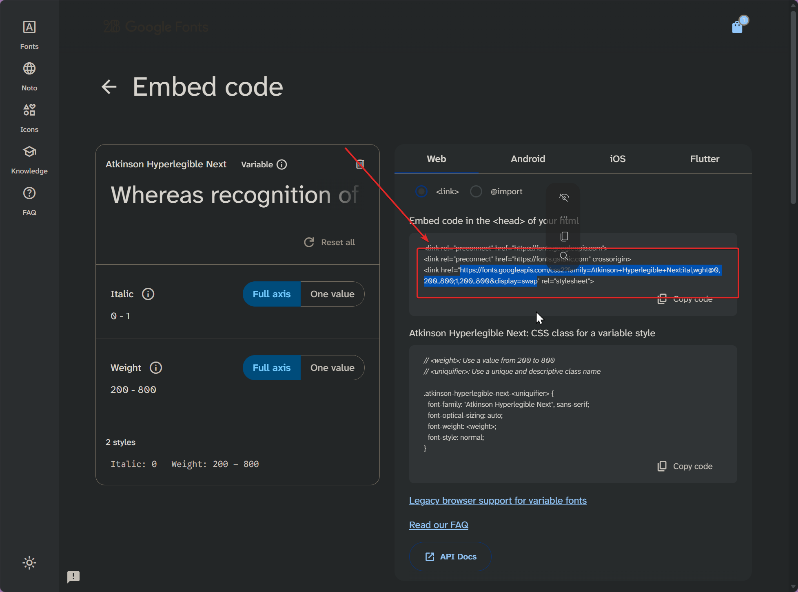

# dioxus_google_font_embedder

[](https://crates.io/crates/dioxus_google_font_embedder)
[](https://crates.io/crates/dioxus_google_font_embedder)
[](https://docs.rs/dioxus_google_font_embedder)

Rust macro that automatically downloads, caches, and embeds Google Fonts (OR ANY GENERIC CDN FILE) into a Dioxus app at
compile-time via `asset!()` for offline usage

[crates.io page](https://crates.io/crates/dioxus_google_font_embedder)

## Installation

```bash
cargo add dioxus_google_font_embedder
```

or add

```toml
dioxus_google_font_embedder = "1.0.0"
```

to `Cargo.toml` (replace `1.0.0` with the latest version. `cargo add` does this for you)

## `asset_url!()`

the `dioxus_google_font_embedder::asset_url!()` macro takes any valid URL (but typically, a CSS or JS CDN, downloads and
caches them at compile time, and embeds them with the [dioxus
`asset!()` macro](https://dioxuslabs.com/learn/0.7/essentials/ui/assets/) so they can be self-hosted (web) or used offline (desktop/mobile).

## `embed_google_font!()`

the `dioxus_google_font_embedder::embed_google_font!()` macro takes a URL provided by
the [Google Fonts CSS API 2](https://developers.google.com/fonts/docs/css2), (which is easily obtainable via
the [google fonts website](https://fonts.google.com/)), and automatically, at **compile time**, downloads the necessary
CSS and font files from google fonts, caches them, and embeds them with the [dioxus
`asset!()` macro](https://dioxuslabs.com/learn/0.7/essentials/ui/assets/) so they can be self-hosted (web) or used
offline (desktop/mobile).

### Google fonts URL

- Go to [google fonts](https://fonts.google.com/)
- find your font (s)
- click `Get font`
- click `Get embed code`
- copy the `fonts.googleapis.com/css2` URL inside the `<link href="..." rel="stylesheet">` tag



### Usage

- insert `{dioxus_google_font_embedder::embed_google_font!("<URL GOES HERE>")}` into your `rsx!`

The macro returns a `style` tag, the macro works best at the root of your dioxus project (in your `App()` component,
typically)

## Minimal Example

See [examples directory](example) for a full dioxus project example.

```rs
use dioxus::prelude::*;
use dioxus_google_font_embedder::embed_google_font;

fn main() {
    dioxus::launch(App);
}

#[component]
fn App() -> Element {
    rsx! {
        Stylesheet { href: asset_url!("https://cdn.jsdelivr.net/npm/bootstrap@latest/dist/css/bootstrap.min.css") }
        {embed_google_font!("https://fonts.googleapis.com/css2?family=Atkinson+Hyperlegible+Next:ital,wght@0,200..800;1,200..800&display=swap")}
        p {
            font_family: "Atkinson Hyperlegible Next",
            "This text will be rendered using a Google Font and Bootstrap CSS that are downloaded, cached, and embedded at compile time!"
        }
    }
}
```

## Example macro output

The following macro invocation:

```rs
embed_google_font!("https://fonts.googleapis.com/css2?family=Atkinson+Hyperlegible+Next:ital,wght@0,200..800;1,200..800&display=swap")
```

produces

```rs
rsx! { 
    style { 
        { 
            format!(
                include_str!("C:\\Users\\Melody\\RustroverProjects\\dioxus_google_font_embedder\\target\\google-fonts-cache\\9bd45aa30c0a84408de484c7fb63b764.patch.css"), 
                asset!("/target\\google-fonts-cache\\e7941ecf55afb0224596e401889d82fd.woff2"), 
                asset!("/target\\google-fonts-cache\\b9b0d53002a4448e5e379841e1a84584.woff2"), 
                asset!("/target\\google-fonts-cache\\41c65a0c3d9910bf31226e5645b9b823.woff2"), 
                asset!("/target\\google-fonts-cache\\4c3ac728705ccbe64188eaa380ac5050.woff2"), 
                asset!("/target\\google-fonts-cache\\0c98d1a9df148339ae679e5a307477e0.woff2"), 
                asset!("/target\\google-fonts-cache\\a1d966e09ac8517d1e475861f36de3bf.woff2"), 
                asset!("/target\\google-fonts-cache\\4f13e8a433f547b74aa3f761b91bf13a.woff2"), 
                asset!("/target\\google-fonts-cache\\cc63ecbb63cc8aec94cfdac413317722.woff2")
            ) 
        } 
    }
}
```

the `.css` file is CSS (specifying your font file (s)) and also a [
`format!()` string](https://doc.rust-lang.org/std/fmt/) that inserts the `dx`-generated `asset!()` paths into the CSS
`@font-face` declarations (your LOCALLY SERVED font files!) **at build time**.

This will render at runtume as:

```html

<style>
    /* latin-ext */
    @font-face {
        font-family: 'Atkinson Hyperlegible Next';
        font-style: italic;
        font-weight: 200 800;
        font-display: swap;
        src: url(/assets/0c98d1a9df148339ae679e5a307477e0-dxh76a4157b9e94b93.woff2) format('woff2');
        unicode-range: U+0100-02BA, U+02BD-02C5, U+02C7-02CC, U+02CE-02D7, U+02DD-02FF, U+0304, U+0308, U+0329, U+1D00-1DBF, U+1E00-1E9F, U+1EF2-1EFF, U+2020, U+20A0-20AB, U+20AD-20C0, U+2113, U+2C60-2C7F, U+A720-A7FF;
    }

    /* latin */
    @font-face {
        font-family: 'Atkinson Hyperlegible Next';
        font-style: italic;
        font-weight: 200 800;
        font-display: swap;
        src: url(/assets/a1d966e09ac8517d1e475861f36de3bf-dxhdaffd3671d9452e.woff2) format('woff2');
        unicode-range: U+0000-00FF, U+0131, U+0152-0153, U+02BB-02BC, U+02C6, U+02DA, U+02DC, U+0304, U+0308, U+0329, U+2000-206F, U+20AC, U+2122, U+2191, U+2193, U+2212, U+2215, U+FEFF, U+FFFD;
    }

    /* latin-ext */
    @font-face {
        font-family: 'Atkinson Hyperlegible Next';
        font-style: normal;
        font-weight: 200 800;
        font-display: swap;
        src: url(/assets/4f13e8a433f547b74aa3f761b91bf13a-dxhfe9eff60c6c903d.woff2) format('woff2');
        unicode-range: U+0100-02BA, U+02BD-02C5, U+02C7-02CC, U+02CE-02D7, U+02DD-02FF, U+0304, U+0308, U+0329, U+1D00-1DBF, U+1E00-1E9F, U+1EF2-1EFF, U+2020, U+20A0-20AB, U+20AD-20C0, U+2113, U+2C60-2C7F, U+A720-A7FF;
    }

    /* latin */
    @font-face {
        font-family: 'Atkinson Hyperlegible Next';
        font-style: normal;
        font-weight: 200 800;
        font-display: swap;
        src: url(/assets/cc63ecbb63cc8aec94cfdac413317722-dxh69fb5112c76f4012.woff2) format('woff2');
        unicode-range: U+0000-00FF, U+0131, U+0152-0153, U+02BB-02BC, U+02C6, U+02DA, U+02DC, U+0304, U+0308, U+0329, U+2000-206F, U+20AC, U+2122, U+2191, U+2193, U+2212, U+2215, U+FEFF, U+FFFD;
    }
</style>
```

Both this entire `style` tag and the `src:` font files are locally cached and rendered without requiring internet to
access Google's API at runtime! 
